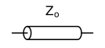
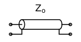
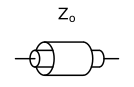
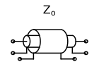

<link rel="stylesheet" href="css/codehilite.css">

## Basic Electrical Elements

A number of common electrical elements are defined in the `SchemDraw.elements` module.

Other components include [Logic Gates](logic.html), [Flowchart Symbols](flowcharts.html), and [Signal Processing Symbols](signals.html).

### Predefined Elements

These elements are defined in static dictionaries.

#### 2-Terminal Elements

#### Sources and meters

#### Grounds

Grounds don't move the current drawing position.

#### Switches

#### Potentiometer

Potentiometer is defined with one additional anchor for the 'tap'.

#### Speaker

#### Opamp

An opamp defines three anchors, in1, in2, and out.

#### Transistors

Transistors also define three anchors as shown below.

Types of transistors are shown below:

#### Connecting elements

Elements are connected with lines and dot elements. Dots don't change the current drawing position.

Coax and triax cables can also be used as connecting element. Anchors are `StartInner`, `EndInner`, `StartOuter`, `EndOuter`, and for the triax  `StartShield` and `EndShield`.

#### Label element

The LABEL element can be used to add a label anywhere. The GAP_LABEL is like an "invisible" element, which can be used for marking the voltage between output terminals.

### Function-defined elements

Some element definition dictionaries can be generated using a function.

#### Transformers

Transformer elements can be generated using the `transformer()` function. Parameters are:

        t1    : Number of turns on primary (left) side
        t2    : Number of turns on secondary (right) side
        core  : Draw the core (parallel lines) [default=False]
        ltaps : Dictionary of name:position pairs, position is the turn number from the top to tap
                Each tap defines an anchor point but does not draw anything.
        rtaps : Same as ltaps, on right side
        loop  : Use spiral/cycloid (loopy) style [default=False]

Two transformers with cycloid=False (left) cycloid=True (right). Anchor names are p1, p2 for the primary (left) side,
and s1, s2 for the secondary (right) side.

Example usage with taps:

    :::python
    xf = d.add(e.transformer(t1=4, t2=8, rtaps={'B':3}, loop=False))
    d.add(e.LINE, xy=xf.s1, l=d.unit/4)
    d.add(e.LINE, xy=xf.s2, l=d.unit/4)
    d.add(e.LINE, xy=xf.p1, l=d.unit/4, d='left')
    d.add(e.LINE, xy=xf.p2, l=d.unit/4, d='left')
    d.add(e.LINE, xy=xf.B, l=d.unit/2, d='right', rgtlabel='B')
    

#### Black-box elements

Elements drawn as boxes, such as integrated circuits, can be generated using the `elements.blackbox()` function. An arbitrary number of inputs/outputs can be drawn to each side of the box. The inputs can be evenly spaced (default) or arbitrarily placed anywhere along each edge. The function takes the arguments:

        w, h : width and height of rectangle
        mainlabel : main box label
        leadlen   : length of lead extensions
        lblsize   : default font size of labels
        lblofst   : default label offset
        plblsize  : default pin label size
        plblofst  : default pin label offset
        hslant    : angle (degrees) to slant horizontal sides
        vslant    : angle (degrees) to slant vertical sides
        linputs, rinputs, tinputs, binputs: dictionary input definition for each side
        of the box. Default to no inputs. Dictionary keys:
            labels: list of string labels for each input. drawn inside the box. default is blank. label of '>' will be converted to a clock input.
            plabels: list of pin label strings. drawn outside the box. Default is blank.
            spacing: distance between pins. Defaults to evenly spaced pins along side.
            loc: list of pin locations (0 to 1), along side. Defaults to evenly spaced pins. Overrides spacing argument.
            leads: True/False, draw leads coming out of box. Default=True.
            lblofst: float offset for labels. Default=.15
            plblofst: float offset for pin labels. Default=.1
            lblsize: font size for labels. Default=16
            plblsize: font size for pin labels. Default=12

Anchors to each input will be automatically generated using the 'labels' keyword for each side of the box if provided. Duplicate input names will be appended with a number. If not provided, the anchors will be named 'inL1', 'inL2'... for the left side, for the right side 'inR1', inR2', etc.

For example, a full-adder box can be made with inputs on all sides:

    :::python
    tinputs = {'cnt':2, 'labels':['b','a']}
    rinputs = {'cnt':1, 'labels':['$c_{in}$']}
    linputs = {'cnt':1, 'labels':['$c_{out}$']}
    binputs = {'cnt':1, 'labels':['$s$']}
    B = e.blackbox(d.unit, d.unit, linputs=linputs, binputs=binputs, tinputs=tinputs, rinputs=rinputs)

See the [555-timer circuit] example below for a more complete usage of `blackbox()`.

#### Multiplexers

Multiplexers and demultiplexers may be drawn using the `elements.mux()` method which creates a blackbox element. Arguments include:

    inputs: list of strings
        Name of each input
    outputs: list of strings
        Name of each output
    ctrls: list of strings
        Name of control signals (bottom)
    topctrls: list of strings
        Name of control signals on top side
    demux: boolean
        Draw as demultiplexer
    h: float, optional
        Height of multiplexer
    w: float, optional
        Width of multiplexer
    pinspacing: float
        distance between pins on input/output side
    ctrlspacing: float
        distance between pins on control side
    slope: float
        angle (degrees) to slope top and bottom
    **kwargs:
        keyword arguments to pass to blackbox method

Example: 

    :::python
    m1 = e.mux(inputs=['A','B','C','D'], outputs=['X'], ctrls=['0','1'])
    d.add(m1)

------------------------------------------------------
[Return to SchemDraw documentation index](index.html)