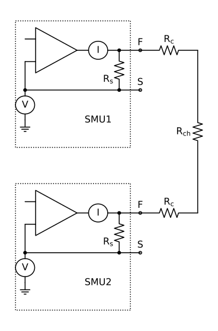
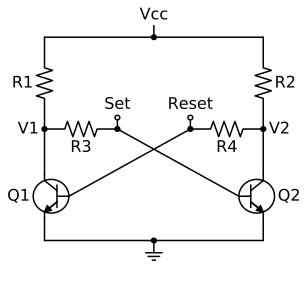
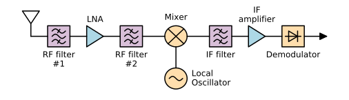
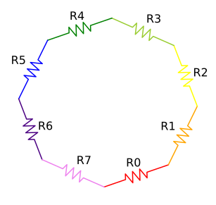
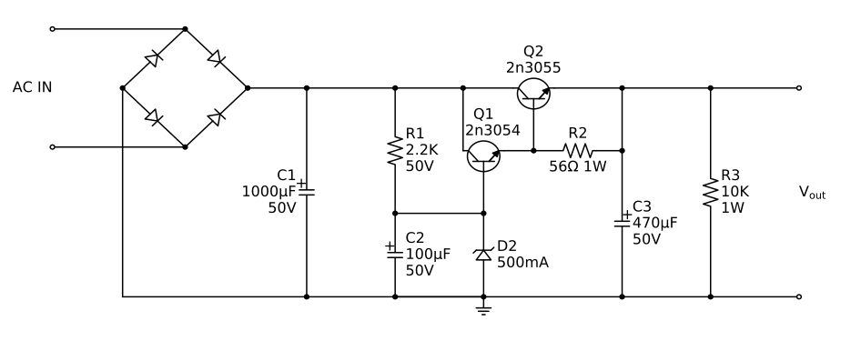

<link rel="stylesheet" href="css/codehilite.css">

## SchemDraw Gallery

### Charging capacitor

[Source](gallery/cap_charge.py)

-----------------------------------------------------------
### Loop Currents

[Source](gallery/loop_current.py)

-----------------------------------------------------------
### Operational Amplifier

[Source](gallery/opamp.py)

-----------------------------------------------------------
### Source-Measure-Unit (SMU)

This example demonstrates grouping elements into a unit. 
Each SMU is grouped into a unit which is then placed where needed.

[Source](gallery/smu.py)

-----------------------------------------------------------
### SR Latch

[Source](gallery/SR.py)

-----------------------------------------------------------
### Superheterodyne Receiver

Demonstrates use of signal processing elements.

[Source](gallery/receiver.py)

-----------------------------------------------------------
### Resistor circle

Shows creation of elements within for loop, angled elements with automatic label positioning, and colors.

[Source](gallery/Rcircle.py)

-----------------------------------------------------------
### Power Supply

[Source](gallery/powersupply.py)

-----------------------------------------------------------
### 741 Op-Amp

Internal schematic of a 741 IC.

[Source](gallery/741.py)

-----------------------------------------------------------
### Flowchart

Recreate [XKCD 518](https://xkcd.com/518/) using SchemDraw.

[Source](gallery/flowchart.py)

