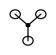

<link rel="stylesheet" href="css/codehilite.css">

## SchemDraw Usage

SchemDraw works on the principle of creating a drawing object, and then adding elements to it. Common elements are defined in SchemDraw.elements, and additional elements can easily be created (see [Defining New Elements](#DefiningElements)).

Start by setting up a new drawing:

    :::python
    import SchemDraw
    import SchemDraw.elements as e
    d = SchemDraw.Drawing()

Then use the `add()` method to add elements:

    :::python
    d.add(e.RES, label='100$\Omega$')
    d.add(e.CAP, label='0.1$\mu$F')

And finish by calling `draw()`, and `save()` for a image file:

    :::python
    d.draw()
    d.save('testschematic.pdf')

### Element properties

The `add()` method takes a number of arguments to define the element position. The first argument is the element definition dictionary.

#### Position and direction

The position of each element can be specified in a number of ways. If no position is given, it will start at the current drawing position, typically where the previous element ends, and in the current drawing direction.

Otherwise, position can be specified using some combination of the keyword arguments:

        xy     : [x,y] starting coordiante.
                 Element drawn in current direction and default length.
        endpts : [[x1,y1], [x2,y2]] start and end coordinates
        to     : [x,y] end coordinate
        tox    : x-value of end coordinate (y-value same as start)
        toy    : y-value of end coordinate (x-value same as start)
        l      : total length of element
        zoom   : zoom/magnification for element (default=1)
        anchor : 'xy' argument refers to this position within the element.
                 For example, an opamp can be anchored to 'in1', 'in2', or 'out'

'to', 'tox', 'toy', 'l' can be used with 'xy' to define start and end points.

If only a starting coordinate is given, the direction defaults to the last element's direction unless specified by either:

        d       : (string) direction ['up','down','left','right']
        theta   : (float) angle in degrees to draw the element. Overrides 'd'.

#### Anchoring

Some elements define extra anchors. These are positions that can be used to position this element, or other elements connecting to it. For example, an opamp defines three anchor points: in1, in2, and out.

When placing the opamp, it can then be located with respect to the correct terminal. The following will place an opamp with in2 connected to the endpoint of the resistor:

    :::python
    d.add(e.RES, label='Rin')
    op = d.add(e.OPAMP, anchor='in2')

Then, to place a resistor on the output

    :::python
    d.add(e.RES, xy=op.out, label='Ro')

All elements have at least three anchors: 'start', 'end', and 'center'.

#### Element orientation

An element can be reversed (for example a diode), or flipped vertically using the arguments:

        flip    : (bool) flip the element vertically (when theta=0)
        reverse : (bool) reverse a directional element (e.g. diode)

### Labels

A label string can be added to the element using the 'label' argument (default position) or with 'toplabel', 'botlabel', 'lftlabel', or 'rgtlabel'. Labels can be added in multiple positions, for example labeling a component name with toplabel='R1' and value botlabel='100'. For math symbols, enclose the string in dollar-signs to enable latex-style math mode, e.g.

    :::python
    label='$R_1 = 100 \Omega$'

Label related arguments include:

        label, toplabel, botlabel, lftlabel, rgtlabel:
            Add a string label to the element.
        lblofst : offset between text label and element

A label can also be defined as a list of strings. In this case, the strings will be evenly spaced along the length of the element. This is useful for labeling polarities, for example 

    :::python
    label=['+','$v_o$','-'].

Labels can also be added to an element after it is added to the drawing using the element's add_label() method. This allows arbitrary positions and infinite number of labels.

    :::python
    D1 = d.add(e.DIODE, label='D1')
    D1.add_label('1N4001', loc='bot')
    D1.add_label('a', loc='lft')
    D1.add_label('b', loc='rgt')

The `add_label()` method takes the following arguments:

        label: text label to add
        loc: location for the label ['top', 'bot', 'lft', 'rgt'].
        txtofst: unit offset between element bounding box and label.
        align: alignment tuple for (horizontal, vertical):
               (['center', 'left', 'right'], ['center', 'top', 'bottom'])

### Other

Other element arguments include:

        move_cur : move the cursor after drawing. Default=True.
        color    : matplotlib color. e.g. 'red', '#34a4e6', (.8,0,.8)
        ls       : [':', '--', '-'] linestyle (same as matplotlib).

### Grouping Elements

If a set of circuit elements are to be reused multiple times, they can be grouped into a sub-drawing. Create and populate a drawing, but don't draw it. Instead, use `group_elements()`, then add the result as an element to another drawing:

    :::python
    d1 = SchemDraw.Drawing()
    d1.add(e.RES)
    d1.push()
    d1.add(e.CAP, d='down')
    d1.add(e.LINE, d='left')
    d1.pop()
    RC = SchemDraw.group_elements(d1)   # Create the group to reuse

    d2 = SchemDraw.Drawing()   # Add the group to another drawing several times
    for i in range(3):
        d2.add(RC)
    d2.draw()

### Drawing parameters

When setting up a new schematic drawing, a few parameters are available to set the overall drawing size. Arguments to `Drawing()` are:

        unit : Full length of a resistor element in matplotlib plot units.
               Inner portion of resistor is length 1. Default=3.
        inches_per_unit : inches per unit to scale drawing. Default=.5
        txtofst  : Default distance from element to text label. Default=0.1.
        fontsize : Default font size. Default=16.
        font     : matplotlib font-family. Default='sans-serif'.

### Drawing state

The drawing state (current position and direction), can be saved and recalled using:

    :::python
    d.push()   # Save the drawing state
    ... Do some things that change the drawing state
    d.pop()    # Recall the drawing state

### Saving an image

The final image can be saved to a file using `d.save()`. The filename extension determines the type of file to be saved. Any matplotlib-compatible file format can be used. Saving in a vector-based format, such as eps, pdf, or svg, is recommended for best quality.

    :::python
    d.save('testimage.eps')

### Current Arrow

To label the current through an element, the ARROWI element is defined. Typically, it can be added alongside an existing element using the drawing's `labelI()` method, which takes the arguments:

        elm       : element to add arrow to
        label     : (string) string or list of strings to space along arrow
        arrowofst : (float) distance from element to arrow
        arrowlen  : (float) length of arrow in drawing units
        reverse   : (bool) reverse the arrow, opposite to elm.theta
        top       : (bool) draw on top (or bottom) of element

For example:

    :::python
    R1 = d.add(e.RES)
    d.labelI(R1, '10mA')

### Loop currents

Loop currents can be added using the drawing's `loopI()` method:

        elm_list : boundary elements in order of top, right, bot, left
        label    : text label for center of loop
        d        : arrow direction 'cw' or 'ccw'. Default='cw'
        theta1   : start angle of arrow arc (degrees). Default=35
        theta2   : end angle of arrow arc (degrees). Default=-35

For example:

    :::python
    R1 = d.add(e.RES)
    C1 = d.add(e.CAP, d='down')
    D1 = d.add(e.DIODE_F, d='left')
    L1 = d.add(e.INDUCTOR, d='up')
    d.loopI([R1, C1, D1, L1], d='cw', label='$I_1$')

-------------------------------------------------------

### Defining New Elements

New elements can be defined by creating a python dictionary describing how the element should be drawn. An element can be made up of paths and/or shapes. A path is simply a list of xy coordinates which will be plotted with matplotlib. A shape is a predefined matplotlib patch, such as a circle (defined by center and radius).

Coordinates are all defined in element cooridnates, where the element begins
at [0,0] and is drawn from left to right. The drawing engine will then rotate
and translate the element to its final position. A standard resistor is
1 drawing unit long, and with default lead extension will become 3 units long.

Possible dictionary keys:

        name:  A name string for the element. Currently only used for testing.
        paths: A list of each path line in the element. For example, a capacitor
               has two paths, one for each capacitor "plate". On 2-terminal
               elements, the leads will be automatically extended away from the
               first and last points of the first path, and don't need to
               be included in the path.
        base:  Dictionary defining a base element. For example, the variable
               resistor has a base of resistor, then adds an additional path.
        shapes: A list of shape dictionaries.
                'shape' key can be [ 'circle', 'poly', 'arc', 'arrow' ]
                Other keys depend on the shape as follows.
                circle:
                    'center': xy center coordinate
                    'radius': radius of circle
                    'fill'  : [True, False] fill the circle
                    'fillcolor' : color for fill
                poly:
                    'xy' : List of xy coordinates defining polygon
                    'closed': [True, False] Close the polygon
                    'fill'  : [True, False] fill the polygon
                    'fillcolor' : color for fill
                arc:
                    'center' : Center coordinate of arc
                    'width', 'height': width and height of arc
                    'theta1' : Starting angle (degrees)
                    'theta2' : Ending angle (degrees)
                    'angle'  : Rotation angle of entire arc
                    'arrow'  : ['cw', 'ccw'] Add an arrowhead, clockwise or counterclockwise
                arrow:
                    'start'  : start of arrow
                    'end'    : end of arrow
                    'headwidth', 'headlength': width and length of arrowhead
        theta: Default angle (in degrees) for the element. Overrides the current
               drawing angle.
        anchors: A dictionary defining named positions within the element. For
                 example, the NFET element has a 'source', 'gate', and 'drain'
                 anchor. Each anchor will become an attribute of the element class
                 which can then be used for connecting other elements.
        extend: [True, False] Extend the leads to fill the full element length.
        move_cur: [True, False] Move the drawing cursor location after drawing.
        color: A matplotlib-compatible color for the element. Examples include
               'red', 'blue', '#34ac92'
        drop: Final location to leave drawing cursor.
        lblloc: ['top', 'bot', 'lft', 'rgt'] default location for text label.
                Defaults to 'top'.
        lblofst: Default distance between element and text label.
        labels: List of (label, pos) tuples defining text labels to always draw
                in the element.
        ls    : [':', '--', '-'] linestyle (same as matplotlib). Only applies to paths.

For an example, let's make a flux capacitor circuit element. Here, we'll start by defining the `fclen` variable as the length of one leg so we can change it easily. Remember a resistor is 1 unit long.

    :::python
    fclen = 0.5
    
The custom element is a dictionary of parameters. We want a dot in the center of our flux capacitor, so use the `base` key to start with the already defined `DOT` element.

    :::python
    FLUX_CAP = {
        'base': e.DOT,

Next, add the paths, which are drawn as lines. The flux capacitor will have three paths, all extending from the center dot:

    :::python
    'paths': [[[0, 0], [0, -fclen*1.41]],  # Leg going down
              [[0, 0], [fclen, fclen]],    # Leg going up/right
              [[0, 0], [-fclen, fclen]]],  # Leg going up/left

And at the end of each path is an open circle. These are added to the dictionary using the `shapes` key as a list of shape dictionaries.

    :::python
    'shapes': [{'shape': 'circle', 'center': [0, -fclen*1.41], 'radius': .2, 'fill': False},
               {'shape': 'circle', 'center': [fclen, fclen], 'radius': .2, 'fill': False},
               {'shape': 'circle', 'center': [-fclen, fclen], 'radius': .2, 'fill': False}],
    
Finally, we need to define anchor points so that other elements can be connected to the right places. Here, they're called `p1`, `p2`, and `p3` for lack of better names.

    :::python
    'anchors': {'p1': [-fclen, fclen], 'p2': [fclen, fclen], 'p3': [0, -fclen]}
    
Here's the element dictionary all in one:

    :::python
    fclen = 0.5
    FLUX_CAP = {
        'base': e.DOT,
        'paths': [[[0, 0], [0, -fclen*1.41]],  # Leg going down
                  [[0, 0], [fclen, fclen]],    # Leg going up/right
                  [[0, 0], [-fclen, fclen]]],  # Leg going up/left
        'shapes': [{'shape': 'circle', 'center': [0, -fclen*1.41], 'radius': .2, 'fill': False},
                   {'shape': 'circle', 'center': [fclen, fclen], 'radius': .2, 'fill': False},
                   {'shape': 'circle', 'center': [-fclen, fclen], 'radius': .2, 'fill': False}],
        'anchors': {'p1': [-fclen, fclen], 'p2': [fclen, fclen], 'p3': [0, -fclen]}}

Test it out by adding the new custom element to a drawing:

    :::python
    d = schem.Drawing()
    fc = d.add(FLUX_CAP)
    d.draw()

------------------------------------------------

### XKCD Mode!

For something fun, you can turn on Matplotlib's XKCD mode to get "hand-drawn" schematics.

    :::python
    import matplotlib.pyplot as plt
    plt.xkcd()    
    d = SchemDraw.Drawing()
    ...
    d.draw()

------------------------------------------------------
[Return to SchemDraw documentation index](index.html)